# FlowKey: a anatomia de um launcher nativo para Windows — C#, Bun e React sem navegador

_Um mergulho completo na arquitetura do projeto: do WPF ao protocolo NDJSON, do reconciler React
customizado ao modelo de consentimento que impede extensões de tocar no seu sistema sem permissão._

**Índice**

1. [O que é o FlowKey](#1-o-que-é-o-flowkey)
2. [A arquitetura em três camadas](#2-a-arquitetura-em-três-camadas)
3. [O protocolo: NDJSON sobre stdio](#3-o-protocolo-ndjson-sobre-stdio)
4. [Contract fixtures: a "lei do fio"](#4-contract-fixtures-a-lei-do-fio)
5. [O Shell em C# (.NET 8 + WPF)](#5-o-shell-em-c-net-8--wpf)
6. [O Sidecar: o cérebro em TypeScript rodando no Bun](#6-o-sidecar-o-cérebro-em-typescript-rodando-no-bun)
7. [O reconciler React customizado (@flowkey-cli/react-ui)](#7-o-reconciler-react-customizado-flowkey-clireact-ui)
8. [O SDK (@flowkey-cli/native-sdk)](#8-o-sdk-flowkey-clinative-sdk)
9. [A CLI (@flowkey-cli/cli) e o fluxo do desenvolvedor](#9-a-cli-flowkey-clicli-e-o-fluxo-do-desenvolvedor)
10. [As extensões de primeira parte](#10-as-extensões-de-primeira-parte)
11. [O modelo de segurança: fail-closed do início ao fim](#11-o-modelo-de-segurança-fail-closed-do-início-ao-fim)
12. [A interface web: WebView2 onde faz sentido](#12-a-interface-web-webview2-onde-faz-sentido)
13. [Qualidade: testes, fixtures e CI](#13-qualidade-testes-fixtures-e-ci)
14. [Números do projeto](#14-números-do-projeto)
15. [Criando sua própria extensão](#15-criando-sua-própria-extensão)
16. [Conclusão](#16-conclusão)

---

## 1. O que é o FlowKey

O **FlowKey** é um launcher para Windows na linha do Raycast e do Alfred: você aperta um atalho
global (por padrão `Alt+Space`, configurável), a janela surge no centro da tela, e dali você busca
aplicativos, faz cálculos, controla o Spotify, traduz texto, busca emojis, ícones e notas do
Obsidian — tudo pelo teclado.

A premissa técnica que guia todo o projeto está resumida no README:

> Extensões são escritas em TypeScript + React, rodam em um processo sidecar com Bun e serializam
> para uma árvore de UI nativa: **sem web view, sem Electron, sem DOM**.

Ou seja: o desenvolvedor de extensão escreve React como estaria acostumado a fazer, mas o resultado
não vira HTML — vira um JSON descrevendo uma árvore de interface que o shell C# renderiza com
controles WPF nativos. O resultado é um app que parece ter sido feito inteiramente em código nativo,
mas com um ecossistema de extensões tão produtivo quanto o de um launcher baseado em web.

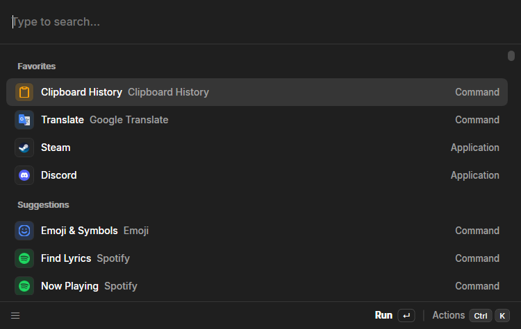

<!-- 📷 ESPAÇO PARA IMAGEM: captura da paleta de ações (Ctrl+K) aberta sobre a lista de resultados.
     Sugestão de arquivo: docs/images/flowkey-action-panel.png -->

### 1.1 O que ele faz hoje

**Núcleo do launcher:**

- **Invocação em qualquer lugar** — atalho global rebindável, auto-ocultar ao perder foco, ícone na
  bandeja (tray), instância única.
- **Busca e execução de apps** — enumeração do Menu Iniciar via COM, resultados ranqueados por uso
  com favoritos.
- **Busca de comandos** — todo comando de extensão é pesquisável pela raiz, com hotkeys por
  comando.
- **Calculadora** — avaliação instantânea na barra de busca, com conversão de unidades, matemática
  de datas e câmbio de moedas.
- **Histórico de clipboard** — texto, arquivos e imagens, com busca, ações por entrada e colar no
  app em primeiro plano.
- **Painel de ações** — `Ctrl+K` abre todas as ações disponíveis para o item selecionado.
- **HUD e toasts** — overlays transitórios para feedback de extensões.
- **App de configurações** — geral, atalhos por comando, uma página por extensão (preferências,
  contas OAuth, hotkeys) e atualizações.
- **Auto-atualização** — Velopack contra GitHub Releases; instalador e zip portátil por release.

**Extensões embutidas de fábrica:** Apps, Calculadora, Histórico de Clipboard, Emoji & Símbolos,
Google Translate, Spotify (com OAuth), Lucide Icons (1.636 ícones, offline), Obsidian Notes,
Quicklinks, Snippets, System e Window Switcher — 12 extensões e 57 comandos no total.

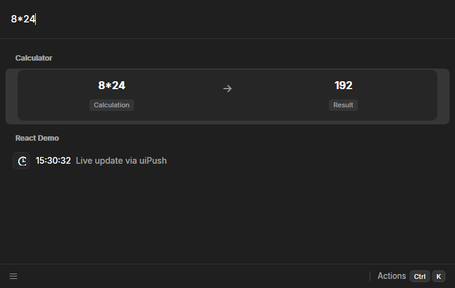

Uma nota histórica interessante: o repositório se chama `asyar` e guarda vestígios de uma encarnação
anterior do projeto — havia uma versão em **Tauri + Svelte** (há até uma tag `baseline-tauri` no
git). A reescrita para o shell C# atual foi o momento em que o projeto apostou de vez em renderização
nativa.

---

## 2. A arquitetura em três camadas

O princípio organizador do projeto é uma frase que aparece nos documentos internos e se repete em
todo o código: **"shell is the gate, sidecar is the brain"** — o shell é o portão, o sidecar é o
cérebro.

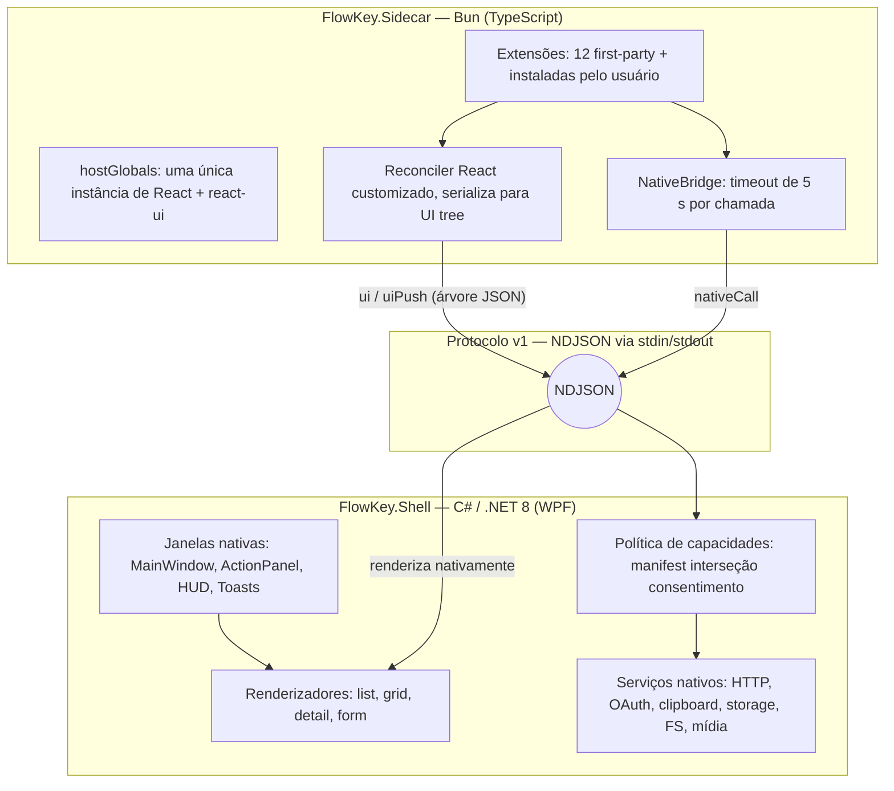

- **Shell (C#, .NET 8 WPF)** — dono de tudo que é privilegiado: janela, bandeja, atalhos globais,
  clipboard, rede, OAuth, segredos criptografados, mídia, armazenamento. É também o **porteiro**:
  toda chamada de extensão passa por uma verificação de manifesto + consentimento antes de tocar no
  SO.
- **Sidecar (Bun, TypeScript)** — processo filho que carrega as extensões, roda o React delas por
  meio de um reconciler customizado e serializa a UI em árvores JSON. Não sabe nada sobre o sistema
  de arquivos do usuário além do que o shell permitir.
- **Contrato (`contract/`)** — três fixtures JSON que definem o protocolo, a árvore de UI e as regras
  de manifesto. São testadas **dos dois lados** (Bun e xUnit), o que torna impossível uma das
  linguagens "andar" sem a outra.

A divisão é rígida de propósito: se você mudar o protocolo no TypeScript e esquecer o C#, o CI falha
— e vice-versa.

### 2.1 Os três pacotes npm públicos

Para o desenvolvedor de extensões, o projeto se materializa em três pacotes publicados no npm:

| Pacote                    | Versão | O que entrega                                                                                                           |
| ------------------------- | :----: | ----------------------------------------------------------------------------------------------------------------------- |
| `@flowkey-cli/cli`        | 0.4.0  | `init` (scaffold), `dev` (watch), `build`, `validate` (lint de manifesto), `package` (zip `.flowkey`), shims e template |
| `@flowkey-cli/native-sdk` | 0.5.2  | Tipos do protocolo, validador de manifesto (as mesmas regras do shell) e helpers tipados de capacidades                 |
| `@flowkey-cli/react-ui`   | 0.3.0  | `<List>`, `<Grid>`, `<Detail>`, `<Form>`, `<ActionPanel>`, `<Action>`, hooks de dados, ícones emoji/lucide/SVG/imagem   |

---

## 3. O protocolo: NDJSON sobre stdio

Entre shell e sidecar não há HTTP, WebSocket nem gRPC. Há **uma linha de JSON por mensagem** no
stdin/stdout do processo filho — NDJSON (Newline-Delimited JSON). Simples, fácil de debugar
(`FLOWKEY_LOG=1` loga tudo), e impossível de travar por keep-alive.

```json
{"type":"search","requestId":"s-1","extensionId":"spotify","query":"daft punk"}
{"type":"ui","requestId":"s-1","tree":{"type":"list","sections":[{"title":"Faixas","items":[...]}]}}
{"type":"nativeCall","requestId":"n1","extensionId":"spotify","method":"http.fetch","params":{"url":"https://api.spotify.com/v1/search?q=daft%20punk"}}
```

Detalhes que importam:

- **stdout é sagrado.** Só protocolo. Qualquer `console.log` de extensão é desviado para stderr,
  que o shell trata como canal de logs.
- **IDs de correlação.** O shell numera buscas/ações (`s1`, `s2`…, `a1`…) e o sidecar numera chamadas
  nativas (`n1`, `n2`…). Cada `nativeCall` pendente tem deadline de **5 segundos** por padrão.
- **Handshake de versão.** O `init` carrega `protocolVersion: 1`; se divergir do esperado, o processo
  morre na hora (o sidecar sai com código 2, o shell levanta erro fatal "shell vX, sidecar vY").
- **Resiliência.** O sidecar roda dentro de um _Job Object_ do Windows com `KILL_ON_JOB_CLOSE`: se o
  shell cair, o sidecar morre no kernel. Se o sidecar cair, o shell reinicia com backoff exponencial
  (500 ms → 10 s) e mostra um toast "sidecar crashed. Restarting…".

### 3.1 As 18 mensagens do protocolo v1

| Direção         | Tipo            | Para que serve                                                                               |
| --------------- | --------------- | -------------------------------------------------------------------------------------------- |
| shell → sidecar | `init`          | Abre a conversa: versão, diretório de extensões, preferências, extensões desabilitadas       |
| shell → sidecar | `search`        | Busca na raiz (fan-out para todas as extensões) ou dentro de um comando (`commandId`)        |
| shell → sidecar | `action`        | Usuário disparou uma ação (`Ctrl+K`, Enter, atalho), pode carregar `formValues` de um form   |
| shell → sidecar | `preferences`   | Preferências de uma extensão mudaram nas configurações                                       |
| shell → sidecar | `nativeResult`  | Resposta de uma `nativeCall` (ok com resultado, ou erro com `code`/`message`)                |
| shell → sidecar | `webCall`       | Relay: uma página WebView2 quer chamar uma capacidade nativa                                 |
| shell → sidecar | `webAbort`      | Cancela uma chamada de webview pelo `bridgeId`                                               |
| sidecar → shell | `ready`         | Lista de extensões carregadas (comandos, métodos declarados, hosts, OAuth) + falhas de carga |
| sidecar → shell | `ui`            | Árvore de UI em resposta a um `search`/`action` (leva `requestId`)                           |
| sidecar → shell | `uiPush`        | Atualização assíncrona da árvore (dados que chegaram depois), **sem** `requestId`            |
| sidecar → shell | `error`         | Exceção dentro de um handler de busca/ação                                                   |
| sidecar → shell | `nativeCall`    | Extensão pedindo uma capacidade nativa                                                       |
| sidecar → shell | `windowCommand` | `closeMainWindow` / `popToRoot` / `clearSearchBar`                                           |
| sidecar → shell | `launchCommand` | Extensão quer invocar outro comando                                                          |
| sidecar → shell | `webView`       | Abre a superfície WebView2 de um comando `ui: "web"`                                         |
| sidecar → shell | `webResult`     | Resposta do relay de webview                                                                 |
| sidecar → shell | `ack`           | Confirmação de comandos em background                                                        |
| sidecar → shell | `log`           | debug/info/warn/error                                                                        |

### 3.2 O caminho de uma busca, ponta a ponta

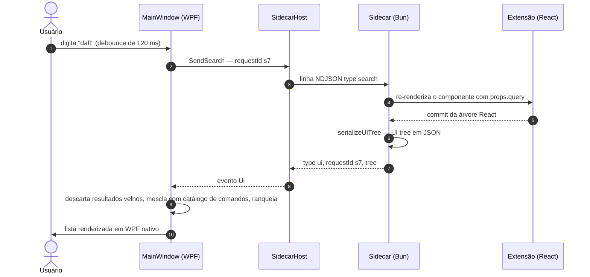

Pontos finos desse fluxo:

- Na **raiz** do launcher, o shell dispara **uma busca por extensão pronta** (fan-out), tudo
  controlado por geração/`requestId` num `SearchState` que joga fora respostas atrasadas.
- Resultados de extensão são mesclados com um **catálogo fuzzy de comandos** e comandos embutidos
  (Configurações, Recarregar extensões, Verificar atualizações, Sair). O fuzzy matcher pontua:
  exato 120, prefixo 100, prefixo-de-palavra 90, subsequência delimitada com bônus de fronteira, e
  penalidade de −20 para um erro de digitação.
- Sem resultados? A busca vira sugestão de **pesquisa na web** (Google/DuckDuckGo).

---

## 4. Contract fixtures: a "lei do fio"

Em `flowkey-native/contract/` vivem três arquivos JSON que funcionam como lei constitucional entre
C# e TypeScript:

| Fixture                 | O que fixa                                                                                                                                                                                                                      |
| ----------------------- | ------------------------------------------------------------------------------------------------------------------------------------------------------------------------------------------------------------------------------- |
| `protocol.fixture.json` | Um exemplo canônico **por mensagem** do protocolo (341 linhas), incluindo casos de erro como uma chamada bloqueada a `evil.example.com`                                                                                         |
| `ui-tree.fixture.json`  | Uma amostra **maximalista de cada tipo de raiz** (`list`, `detail`, `grid`, `form`) — com side-pane, paginação, todos os 10 tipos de campo de formulário, e até um link malicioso `javascript:alert(1)` para testar sanitização |
| `manifest.fixture.json` | **4 manifestos válidos + 22 inválidos**, cada caso de erro esperando um `field` e um `code` específicos                                                                                                                         |

A mágica é que **os dois lados consomem as mesmas fixtures**: os testes Bun do SDK e os testes
xUnit do shell (a classe `UiTreeFixtureTests`, por exemplo) leem os mesmos JSONs e afirmam o mesmo
comportamento. O comentário no cabeçalho da fixture de manifestos resume: _"validator drift fails
both sides"_ — se a validação do TypeScript e a do C# divergirem, as duas suítes quebram.

Isso resolve um problema clássico de sistemas multi-linguagem: o contrato deixa de ser documentação
(vira lei executável).

---

## 5. O Shell em C# (.NET 8 + WPF)

O shell é de longe a maior camada do projeto: **148 arquivos `.cs`, ~29 mil linhas de C#**, mais 6
arquivos XAML com 1.367 linhas. A solução (`FlowKey.sln`) tem dois projetos: `Shell` (o app) e
`Shell.Tests` (xUnit). Apenas três dependências NuGet: **WPF-UI 4.3** (tema Fluent), **Velopack**
(instalador/atualizador) e **WebView2** (só para as superfícies web, como veremos).

### 5.1 Ciclo de vida: do `App.OnStartup` ao tray

`App.xaml.cs` orquestra a inicialização com um cuidado que denota maturidade:

1. `VelopackApp.Build().Run()` roda **antes de qualquer janela** — é o hook que processa
   instalação/desinstalação do instalador.
2. **Instância única** via `Mutex` nomeado (`Local\FlowKey.Shell.SingleInstance`); a segunda cópia
   simplesmente desliga.
3. **Tray icon** (WinForms `NotifyIcon`) com menu em WPF — e um _low-level mouse hook_
   (`WH_MOUSE_LL`) para fechar o menu em cliques externos, porque popups de NotifyIcon não participam
   do handshake de dismissal do WPF.
4. Um handler de exceção do dispatcher engole **exatamente um** bug conhecido de animação do WPF
   (documentado no código), e nada mais.

### 5.2 As janelas

Não há framework MVVM nem pastas de viewmodel — o projeto assume code-behind orquestrador (com a
regra interna de "thin code-behind": lógica de instalação/política vive em classes testáveis sob
`Native/`).

| Janela                  | Tamanho                | Papel                                                                                             |
| ----------------------- | ---------------------- | ------------------------------------------------------------------------------------------------- |
| `MainWindow`            | **4.802 linhas** C#    | O launcher: busca, lista, side-pane, grid, detail, formulários, WebView, rodapé, banner de update |
| `ActionPanel`           | 305 linhas             | A paleta `Ctrl+K`, ancorada no canto inferior direito, com grupos e dicas de teclado              |
| `HudWindow`             | —                      | Overlay do `hud.show`, topo da tela, `WS_EX_NOACTIVATE` (não rouba foco)                          |
| `ToastWindow`           | 256 linhas (code-only) | Toast do canto inferior direito, barra de acento para sucesso/falha                               |
| `SettingsWebViewWindow` | 821 linhas             | Janela de configurações inteira desenhada por uma página WebView2                                 |
| `ExtensionAlertDialog`  | —                      | O `alert.confirm` modal das extensões; botão destrutivo tingido de vermelho                       |

**Atalhos globais** (`HotkeyManager.cs`): um thread STA dedicado bombeia mensagens do Windows e
chama `RegisterHotKey`/`UnregisterHotKey` via fila de requisições — registrar hotkey no thread errado
é um clássico bug de WPF, aqui resolvido por arquitetura. O atalho de invocação padrão é
`Alt+Space` (mesmo do Raycast), com _trial-register_ num id auxiliar antes de trocar de verdade. Cada
comando de extensão pode ter seu próprio hotkey global.

**Summons e auto-hide** (`MainWindow`): ao invocar, o shell lembra qual janela tinha foco antes
(`previousForegroundWindow`) e a restaura ao esconder; um `SetWinEventHook` de `EVENT_SYSTEM_FOREGROUND`
mais um poll de 250 ms escondem o launcher quando outro processo rouba o foco. A janela é
recentrada no **monitor ativo** (matemática em `WindowPlacement.cs`/`MonitorInfo.cs`), com cantos
arredondados e modo escuro via DWM.

### 5.3 Renderizando a UI tree em WPF nativo

Aqui mora a ideia central do projeto. O JSON que chega do sidecar é discriminado por `"type"` em
quatro raízes — `list`, `detail`, `grid`, `form` — e cada uma vira controles WPF reais:

- **Lista**: seções, itens com título/subtitle/**acessórios** (chips coloridos: `success`, `danger`,
  `accent`, `secondary`), **side-pane** de preview (`layout: "side-pane"`), dropdown de filtro,
  empty view, e **paginação server-side** (a última linha "load more" invoca o `moreActionId`
  registrado pela extensão).
- **Grid**: navegação 2D por setas com a matemática isolada em `GridMath.cs` (classe pura,
  100% testada).
- **Detail**: campos texto/link/tags, imagem, e descrição **markdown** via `MarkdownLite.cs` — um
  parser limitado de propósito (teto de 100 mil caracteres de fonte, 2 mil nós, links de até 2.048
  caracteres, aviso de truncamento).
- **Form**: 10 tipos de campo (`textfield`, `password`, `textarea`, `checkbox`, `dropdown`,
  `datepicker`, `tagpicker`, `filepicker`, `description`, `separator`). O **estado do formulário é do
  shell**: quem coleta os valores e os envia de volta no `action` é o código nativo.

Ícones chegam por quatro canais (emoji, nome Lucide + cor, SVG bruto + cor, URI de arquivo) e cada um
tem um renderizador: `LucideIcon.cs` (SVGs empacotados no app viram `Geometry` congeladas com cache),
`SvgIcon.cs` (parse do SVG da extensão, cache por hash de conteúdo), `EmojiSpriteRenderer.cs` (sprite
de 96 px em lote). Há até scroll com inércia (`SmoothScroll.cs`, fricção 0.92 via
`CompositionTarget.Rendering`).

Ações: cada item carrega `UiAction`s com `primary`, `push` (empurra uma sub-view), `style:
"destructive"`, `group` e `shortcut`. O `Ctrl+K` abre o painel ordenado por **uso real**
(`ActionUsageStore` flutua as ações mais usadas). Atalhos de ação só aceitam modificadores de
comando (Ctrl/Alt/Win) — digitar na busca nunca é sequestrado.

<!-- 📷 ESPAÇO PARA IMAGEM: screenshot do painel de ações (Ctrl+K) e de um Detail com side-pane.
     Sugestões de arquivo: docs/images/flowkey-action-panel.png, docs/images/flowkey-detail.png -->

### 5.4 SidecarHost: domando o processo filho

`SidecarHost.cs` (541 linhas) é a ponte para o Bun:

- **Dois modos de spawn**. Em release, executa `FlowKey.Sidecar.exe` — um binário único gerado com
  `bun build --compile`, que embute todas as dependências (o motivo: o empacotamento do Velopack não
  preserva os junctions/symlinks do `node_modules` do pnpm). Em dev, resolve o `bun.exe`
  (`%USERPROFILE%\.bun\bin` → PATH) e roda `bun src/main.ts` direto da árvore do repo.
- **Escrita com thread dedicada**: uma `ConcurrentQueue` drenada por um thread de fundo serializa as
  mensagens de saída; leitura é um loop de `ReadLine` em Task. Exceções de handler são capturadas
  **por mensagem** — um bug de política nunca derruba o loop de leitura (isso evitaria um
  crash-loop).
- **Reinício com backoff** `[500, 1000, 2000, 4000, 8000, 10000]` ms, contador zerado a cada `ready`
  bem-sucedido.

### 5.5 Os serviços nativos (o "backend" de capacidades)

Tudo que toca o SO vive em `src/Shell/Native/` como classe pequena e testável. Os principais:

| Serviço                                                         | O que faz (e os detalhes que valem registro)                                                                                                                                                                                                                                                                                                                     |
| --------------------------------------------------------------- | ---------------------------------------------------------------------------------------------------------------------------------------------------------------------------------------------------------------------------------------------------------------------------------------------------------------------------------------------------------------- |
| `HttpFetchService` + `HttpPolicy`                               | `http.fetch`/`http.upload` com hardening SSRF: **pinning de DNS** via `ConnectCallback` (resolve e valida os IPs antes de conectar), bloqueio de loopback/IPs privados/link-local/CGNAT/multicast, rejeição de credenciais na URL, redirects manuais (máx. 5, revalidados), resposta máx. de **5 MB**, upload de 8 MB, timeout de 10 s, `Retry-After` respeitado |
| `OAuthService` + `TokenVault` + `DpapiProtector`                | OAuth 2.0 **com PKCE (S256)**: `HttpListener` em loopback `127.0.0.1:{porta}/callback`, timeout de 120 s, tokens guardados **criptografados com DPAPI** (`vaulted-tokens.json`). Tokens **nunca chegam à extensão** — o shell injeta o bearer nas chamadas com `auth: "provider"`                                                                                |
| `ClipboardService` + `ClipboardHistoryService`                  | Captura via `WM_CLIPBOARDUPDATE`, histórico de **200 entradas** (100 mil chars por texto), janela de dedupe de 400 ms, previews PNG, nome e ícone do app de origem; política pula cópias feitas por test runners                                                                                                                                                 |
| `AppsFolderEnumerator` + `AppLauncherService` + `AppUsageStore` | Enumeração do Menu Iniciar via COM (`shell:AppsFolder`, AUMIDs), cache de ícones (`IShellItemImageFactory`), `FileSystemWatcher` nas duas raízes do Start Menu com debounce de 1,5 s, contadores de uso em `usage.json` alimentando sugestões                                                                                                                    |
| `ExtensionStorageStore` / `ExtensionCacheStore`                 | KV JSON por extensão: storage 256 chaves / 16 KB por valor / 256 KB total; cache com TTL preguiçoso, 512 chaves / 1 MB total                                                                                                                                                                                                                                     |
| `ExtensionFsService` + `FsPolicy`                               | `fs.readText/writeText/glob/…` com **todo** caminho validado contra os globs do manifesto (com interpolação de `{{preferencia}}`); `..` sempre negado; `fs.trash` vai para a Lixeira                                                                                                                                                                             |
| `ImageFetchService`                                             | `image.fetch`: download de host permitido, máx. 2 MB, redimensiona para ≤ 512 px, cache endereçado por conteúdo com orçamento global de **256 MB**                                                                                                                                                                                                               |
| `MediaSessionService`                                           | `media.current`/`media.control` via **SMTC** do Windows (controle de mídia do sistema) — funciona até sem API de streaming                                                                                                                                                                                                                                       |
| `SystemControlService`                                          | `system.control` com whitelist fechada: `lock`, `sleep`, `mute`, `volume-up/down`, `empty-recycle-bin`, `restart`, `shutdown` — **a whitelist é a superfície de consentimento**                                                                                                                                                                                  |
| `WindowEnumerationService`                                      | `windows.list/focus/close` com `EnumWindows` filtrado (visível, com título, não-tool-window, não-cloaked, fora do próprio shell)                                                                                                                                                                                                                                 |
| `SelectedTextService`                                           | `system.selectedText`: UI Automation (`TextPattern`) primeiro; fallback via clipboard é **opt-in por chamada** (digita Ctrl+C, lê, restaura o clipboard anterior)                                                                                                                                                                                                |
| `PreferencesStore` / `SecretsStore`                             | Preferências com validação de schema e valores `password` cifrados com DPAPI; segredos de extensão (64 chaves / 8 KB) também DPAPI                                                                                                                                                                                                                               |

### 5.6 Atualizações (Velopack)

`UpdateService.cs` checa GitHub Releases **a cada 6 horas** (mais uma checagem no boot se a última
estiver velha há mais de 1 hora). Como o Velopack 1.x não tem fonte GitHub embutida, o projeto
implementou a própria `GitHubReleasesSource` (197 linhas). As fases aparecem num banner dentro do
launcher: Checking → Available → Downloading (com %) → Ready → aplicar e reiniciar.

---

## 6. O Sidecar: o cérebro em TypeScript rodando no Bun

Se o C# é o portão, o sidecar é o cérebro — e é deliberadamente **pequeno**: 5 arquivos, 1.403
linhas.

| Arquivo              | Linhas | Responsabilidade                                                                                    |
| -------------------- | :----: | --------------------------------------------------------------------------------------------------- |
| `src/main.ts`        |  114   | Entry point: instala os host globals, carrega extensões, loop de leitura do stdin, fila até `ready` |
| `src/loader.ts`      |  732   | Registro de extensões, `Dispatcher` (search/action/preferences/webCall), schedules de background    |
| `src/roots.ts`       |  340   | `ManagedRoot`/`RootManager`: ciclo de vida das views React, throttle de `uiPush`, evição LRU        |
| `src/bridge.ts`      |  117   | `NativeBridge`: correlação request/response das `nativeCall`, timeouts e aborts                     |
| `src/hostGlobals.ts` |  100   | Publica React/react-ui/native-sdk do host em `globalThis.__FLOWKEY_HOST__`                          |

### 6.1 Carregamento de extensões

**First-party**: 12 pacotes de workspace importados estaticamente no `REGISTRY` do loader — nunca
saem do bundle.

**Terceira parte**: o `init` traz um `extensionsDir`; o loader varre um diretório por extensão, lê o
`manifest.json`, roda o `validateManifest` do SDK (primeiro erro = `ReadyFailure` com mensagem) e
faz `await import()` do bundle. Colisão de id com extensão first-party? **A first-party vence**; a
instalada é silenciosamente ignorada. Bundle que estoura exceção no import vira uma `ReadyFailure`
— e nunca impede as outras extensões de carregar.

Importante e honesto: **não há sandbox entre extensões**. Elas compartilham o processo Bun. O
modelo de segurança não é isolar extensão de extensão — é garantir que **nenhuma** consiga tocar no
sistema sem passar pelo portão do shell (seção 11).

### 6.2 O ciclo de vida de uma view

Para cada busca que abre um comando, o `Dispatcher` cria um `ReactRoot` (mais sobre ele na seção 7),
renderiza o componente da extensão e serializa o commit. Os detalhes de engenharia que fazem
diferença:

- **Árvore completa, não patches.** Toda mensagem `ui`/`uiPush` carrega a árvore inteira. Dedupe por
  `JSON.stringify` no lado do sidecar (só envia se mudou).
- **`uiPush` com throttle de 100 ms.** Dados assíncronos (um `useFetch` que resolveu depois, um
  timer) disparam pushes coalescidos: no máximo um por intervalo, com timer de borda final.
- **No máximo 4 raízes vivas** (`MAX_ROOTS = 4`) com evição LRU — nunca da raiz ativa.
- **As últimas 4 árvores enviadas são retidas** por raiz, para que cliques em ações ainda resolvam
  mesmo depois de a árvore mudar.

### 6.3 Uma única cópia de React para todos

O detalhe mais elegante do sidecar: `installHostGlobals()` publica em
`globalThis.__FLOWKEY_HOST__` as instâncias **únicas** de React, do react-jsx-runtime, do react-ui e
do native-sdk — **antes** de qualquer bundle de extensão ser importado. O comentário no código
explica o porquê: _"two React copies would break hooks; a second component copy would not
serialize"_ (duas cópias de React quebram hooks; uma segunda cópia dos componentes produziria
elementos que o serializador não reconhece).

Os bundles das extensões nunca embutem React: o CLI reescreve os imports para _shims_ que só
desreferenciam os globals (seção 9). Há um teste no CLI que afirma que o `main.js` emitido contém
`__FLOWKEY_HOST__` e **nenhum** `import from "react"`.

---

## 7. O reconciler React customizado (@flowkey-cli/react-ui)

Aqui está a peça que permite "React sem DOM". O pacote usa o **`react-reconciler`** (versão 0.33.0,
pinada exata — a mesma biblioteca que o React Native usa por baixo) com um host config de ~155
linhas cujas "instâncias" são registros quase triviais:

```ts
// react-ui/src/node.ts — a "instância" do host
type HostNode = { type: string; props: object; children: HostNode[] };
```

Decisões de design que valem destaque:

- **Texto é proibido.** `createTextInstance` lança erro: _"FlowKey UI trees do not support string
  children. Use props like title, subtitle or markdown instead."_ Não existe `<div>texto</div>` —
  texto vai em props, porque é assim que a árvore serializada o representa.
- **Renderização síncrona.** O container é `ConcurrentRoot`, mas o sidecar dirige com
  `updateContainerSync` + `flushSyncWork` — o commit sai na hora, dentro do handler da busca.
- **`commitUpdate` substitui props inteiras** (sem diff) — a serialização compara o JSON final de
  qualquer forma.
- **O commit é o evento.** `resetAfterCommit` dispara um hook registrado num `WeakMap` por container;
  é ali que nasce cada `CommittedGeneration { tree, json, registry }`.

### 7.1 O vocabulário: 24 tags intrínsecas

Os componentes são criados por uma factory `intrinsic(tag)` que registra a relação
função→tag num `WeakMap` (é por isso que o bundle da extensão **precisa** usar a cópia do host: uma
cópia própria geraria elementos que o serializador não reconheceria):

| Família  | Componentes                                                                                                                                                |
| -------- | ---------------------------------------------------------------------------------------------------------------------------------------------------------- |
| `List`   | `List` · `List.Section` · `List.Item` · `List.Item.Detail` · `List.Item.Detail.Metadata` · `.Field` · `List.EmptyView`                                     |
| `Grid`   | `Grid` · `Grid.Section` · `Grid.Item` · `Grid.EmptyView`                                                                                                   |
| `Detail` | `Detail` · `Detail.Metadata` · `Detail.Metadata.Field`                                                                                                     |
| `Form`   | `Form` + 10 campos (`TextField`, `PasswordField`, `TextArea`, `Checkbox`, `Dropdown`, `DatePicker`, `TagPicker`, `FilePicker`, `Description`, `Separator`) |
| Ações    | `ActionPanel` · `Action`                                                                                                                                   |

### 7.2 O serializador: 978 linhas de rigor

`serialize.ts` percorre a árvore de nós e produz o JSON do protocolo com validação fail-closed:

- Exige **exatamente uma raiz** do tipo `list`/`detail`/`grid`/`form`.
- **Allow-lists de props por tag** — prop desconhecida é erro, não warning (`unknown prop 'x' on
<list-item>`).
- IDs duplicados de itens/ações são rejeitados; o id `__open__` é reservado.
- `<Action onAction={fn}>` **nunca cruza o fio**: a função entra num `ActionRegistry` e vira um id
  (`fka0`, `fka1`, …). O mesmo vale para `onSubmit` de formulários (→ `submitActionId`) e para
  `onLoadMore` de paginação (→ `moreActionId`).

Esse design transforma a árvore enviada num **capability token**: o shell só consegue disparar ações
que a extensão de fato renderizou — não existe caminho para "inventar" um id de ação.

### 7.3 Hooks de dados

Sete hooks + um HOF, todos cientes do runtime (`useHostContext` lança erro fora do sidecar):

`usePromise` (com AbortController para rodadas velhas), `useFetch` (passa pelas capacidades HTTP
gateadas), `useDebounce`, `useCachedState` (persiste via `storage.*`), `useLocalStorage`,
`useCachedPromise` (cache com TTL via `cache.*`, hidrata sem flicker) e `withCache` (memoização de
função pelo cache nativo).

---

## 8. O SDK (@flowkey-cli/native-sdk)

O SDK é a superfície tipada que a extensão usa. Cerca de 90 símbolos exportados em ~2.260 linhas,
zero dependência de runtime. O coração é `createCapabilities(call)`: 17 grupos, ~57 métodos que
mapeiam para ~45 rotas nativas do protocolo.

| Grupo                     | Métodos (resumo)                                                                                                                                   |
| ------------------------- | -------------------------------------------------------------------------------------------------------------------------------------------------- |
| `http`                    | `fetch`, `fetchJson<T>`, `upload` — hosts da allowlist; `{ auth: "provider" }` injeta token OAuth no shell                                         |
| `clipboard`               | `read`, `write`, `paste`, `history`, `clearHistory`, `deleteEntry`, `copyEntry`, `pasteEntry`, `editEntry`, `writeContent`, `readContent`, `clear` |
| `storage`                 | `get<T>`, `set`, `delete`, `keys`, `allItems`                                                                                                      |
| `cache`                   | `get`, `set` (com TTL), `delete`, `clear`                                                                                                          |
| `secrets`                 | `get`, `set`, `delete` — DPAPI no lado do shell                                                                                                    |
| `oauth`                   | `authorize`, `status`, `disconnect` — os tokens ficam no cofre do shell                                                                            |
| `fs`                      | `readText`, `writeText`, `delete`, `glob`, `stat`, `mkdir`, `exists`, `copy`, `move`, `trash`                                                      |
| `shell`                   | `openUrl`, `openPath`, `revealPath`, `open`                                                                                                        |
| `windows`                 | `list`, `focus`, `close` — o próprio shell nunca aparece na lista                                                                                  |
| `apps`                    | `list`, `launch`, `frontmost`, `defaultFor`                                                                                                        |
| `media`                   | `current`, `control` (`playPause`/`next`/`previous`)                                                                                               |
| `image`                   | `fetch` — baixa, reduz e cacheia; devolve URI `file:`                                                                                              |
| `system`                  | `selectedText` (UIA; fallback de clipboard opt-in)                                                                                                 |
| `systemControl`           | `execute` — whitelist fechada (lock/sleep/mute/volume/…/shutdown)                                                                                  |
| `hud` / `toast` / `alert` | `show` / `show` / `confirm` (modal que devolve boolean)                                                                                            |

Dois detalhes de contrato que os testes afirmam: `AbortSignal` viaja nas **opções de transporte**,
nunca como parâmetro serializado; e todos os envelopes `storage.get` vêm embrulhados em
`{ ok, value }` (desembrulhado pelo SDK).

### 8.1 O validador de manifesto

`validateManifest()` (~540 linhas) aplica as regras que o shell **replica em C#** e que as fixtures
fixam dos dois lados. Entre as regras:

- `id`: slug `^[a-z0-9][a-z0-9._-]*$`, sem `..`, máx. 64 chars — porque vira **nome de diretório**.
- `entry`: um único `.js` na raiz (default `main.js`).
- Comandos: 1 a 128, ids minúsculos, `__open__` reservado, `mode: view|background`,
  `ui: tree|web`, `interval ≥ 60 s` (só background), até 8 argumentos.
- `nativeMethods` (obrigatório, pode ser `[]`): `namespace.method` ou wildcard de namespace
  (`storage.*`).
- `httpHosts`: hostname, wildcard de sufixo `.cdn.example.com`, porta opcional — **nunca scheme**.
- `fsPaths`: globs absolutos ou enraizados em `{{preferencia}}`, sem travessia.
- `uriSchemes`, `oauth` (ids de provider), até 32 preferências com tipos validados.

---

## 9. A CLI (@flowkey-cli/cli) e o fluxo do desenvolvedor

A CLI (binário `flowkey`) é o que torna possível escrever uma extensão **sem nunca clonar o
repositório do launcher**.

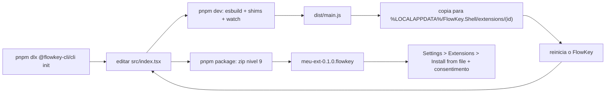

- **`init`** scaffolding a partir de `templates/default/` (manifesto, `src/index.tsx` com exemplo
  real de `fetchJson` contra a API do GitHub, ações com clipboard/storage/hud, tsconfig, README). O
  id derivado do nome é **pré-validado** com o validador do SDK antes de copiar arquivo algum.
- **`build`** empacota com esbuild (`bundle`, `format: esm`, `platform: neutral`, `jsx: automatic`)
  e aplica os **shims**: `react` → `globalThis.__FLOWKEY_HOST__.react`, `@flowkey-cli/react-ui` →
  `…reactUi`, etc. Comandos `ui: "web"` ganham um **segundo bundle IIFE para browser** — com
  react-dom real, sem shims (a página WebView2 é dona do próprio React).
- **`dev`** rebuilda em watch e **instala** o `dist/` direto em
  `%LOCALAPPDATA%\FlowKey.Shell\extensions\<id>\` (o loop documentado: deixar o watch rodando e
  reiniciar o FlowKey).
- **`package`** zipa o `dist/` com fflate (nível 9) em `<id>-<version>.flowkey` — que é **um zip
  comum** com `manifest.json` na raiz, `main.js`, ícone e `*.web.js`.
- **`validate`** roda o lint de manifesto e sai com código 1 em qualquer erro.

O template já declara um conjunto razoável de capacidades (`http.fetch`, `clipboard.write`,
`storage.*`, `shell.openUrl`, `hud.show` e o host `api.github.com`) — que será exatamente o que o
usuário verá no diálogo de consentimento.

---

## 10. As extensões de primeira parte

Doze extensões acompanham o launcher, com **57 comandos** e ~14.800 linhas de código-fonte (mais
~2.700 de testes):

| Extensão              | Comandos |         LOC src         | Destaque técnico                                                                                          |
| --------------------- | :------: | :---------------------: | --------------------------------------------------------------------------------------------------------- |
| **Spotify**           |    32    |          7.390          | OAuth+PKCE feito pelo shell; letras sincronizadas via lrclib.net; controle de mídia por SMTC              |
| **Calculator**        |    2     |          2.484          | Parser próprio (sem `eval`!): moeda → datas → unidades → porcentagem → matemática; câmbio com TTL de 12 h |
| **Google Translate**  |    3     |          1.627          | Token `tk` do Google reimplementado; debounce de 500 ms; corrida por idioma com geração descartada        |
| **Clipboard History** |    2     |          1.208          | 9 métodos `clipboard.*`, previews com app de origem, edição de entradas                                   |
| **Emoji**             |    1     |          1.072          | Catálogo gemoji com 1.870 registros; "Frequentemente usados" com LRU persistido                           |
| **Obsidian Notes**    |    2     |           319           | `fs.glob` confinado a `{{vaultPath}}/**/*.md`; deep links `obsidian://`                                   |
| **Lucide Icons**      |    1     | 198 + 1 MB de metadados | 1.636 ícones 100% offline; ícones viajam como `iconSvg` — o shell continua genérico                       |
| Quicklinks            |    2     |           132           | Links/arquivos/pastas salvos                                                                              |
| Snippets              |    2     |           132           | Textos salvos colados no app em foco                                                                      |
| System                |    8     |           107           | Operações destrutivas exigem `alert.confirm` com `destructive: true`                                      |
| Window Switcher       |    1     |           101           | Não responde ao fan-out da busca raiz (enumerar janelas a cada tecla seria desperdício)                   |
| Apps                  |    1     |           49            | Contadores de uso ("launched Nx")                                                                         |

<!-- 📷 ESPAÇO PARA IMAGEM: grid de ícones Lucide e picker de emoji (imagens já existentes no repo,
     referenciadas abaixo), além de screenshots do Spotify (Now Playing) e do Obsidian Notes.
     Sugestões: docs/images/flowkey-spotify.png, docs/images/flowkey-obsidian.png -->

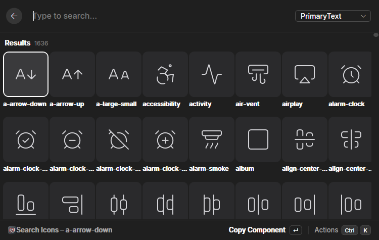

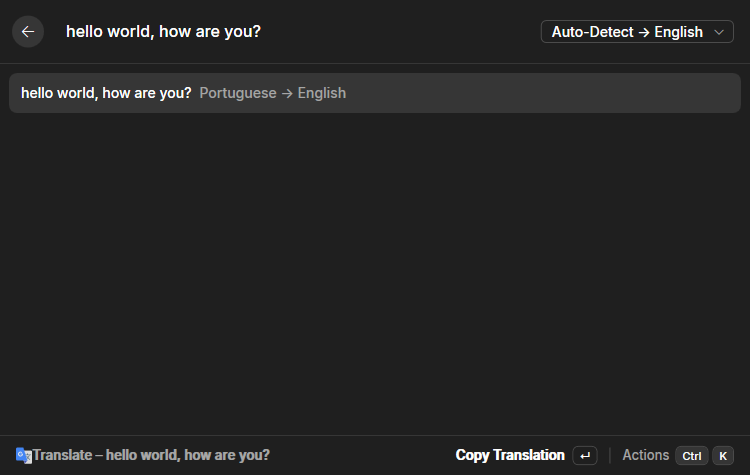

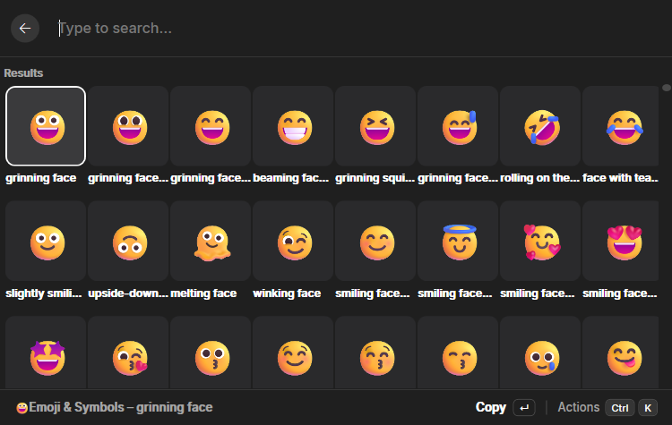

### 10.1 Anatomia de uma extensão

Tomando o Emoji como exemplo (porque ele demonstra o modo `ui: "web"`):

```
extensions/emoji/
├── manifest.json          # comando "open" com ui: "web", webEntry: "app.web.js"
├── data/emoji.json        # catálogo gemoji (428 KB, 1.870 registros)
├── src/
│   ├── index.tsx          # entry do sidecar: defineReactExtension (stub — comando é web)
│   ├── index.web.tsx      # mountWebCommand(EmojiWebApp) — roda no WebView2
│   ├── emoji-model.ts     # busca, categorias
│   └── web/               # app React-DOM de verdade (app.tsx, scroll.ts, frequent-store.ts…)
├── test/                  # 338 linhas de testes bun
└── dist/                  # main.js (sidecar) + app.web.js (webview)
```

O manifesto declara **exatamente** o que usa:

```json
{
  "id": "emoji",
  "version": "2.0.0",
  "commands": [
    {
      "id": "open",
      "title": "Emoji & Symbols",
      "ui": "web",
      "mode": "view",
      "webEntry": "app.web.js"
    }
  ],
  "nativeMethods": ["clipboard.write", "clipboard.paste", "storage.get", "storage.set"],
  "httpHosts": []
}
```

E é isso que o usuário vê no diálogo de consentimento: quatro métodos nativos, zero hosts de rede.

### 10.2 Três micro-estudos de engenharia

**A calculadora que nunca quebra a busca.** O avaliador é um parser escrito à mão (1.656 linhas de
engine) com cascata de detecção: câmbio (`R$ 100 em usd`), matemática de datas, conversão de
unidades, modos de porcentagem (`tip on`, `ratio of X to Y`) e só então expressão matemática. Taxas
vêm da API frankfurter.dev com cache de 12 h e estratégia _stale-while-revalidate_. Toda a execução
está embrulhada: se falhar, "degrada para nenhum cartão" — a busca raiz **nunca** fica quebrada por
causa da calculadora.

**O Spotify cujos tokens não existem para a extensão.** O cliente da API chama
`capabilities.http.fetch(url, { auth: "spotify" })`. O shell valida que o provider está declarado no
manifesto, pega o token do cofre DPAPI (renovando se preciso, com skew de 60 s) e injeta o header.
A extensão nunca vê um token — só `OAuthStatus` (conectado ou não).

**O Lucide offline.** Um script (`scripts/sync-lucide-icons.mjs`) gera
`lucide-metadata.json` com 1.636 ícones — nome, keywords e o SVG canônico de cada um — direto do
pacote `lucide-static`. O JSON é **embutido na extensão**, então a busca funciona sem internet; os
ícones cruzam o protocolo como conteúdo `iconSvg`, mantendo o shell genérico (sem ícones
shippados).

### 10.3 Extensão de terceiro: o Speedtest

Na raiz do repo, `extensions/speedtest/` é a extensão de exemplo de terceiros (port do Speedtest do
Raycast). Ela mede a internet contra `speed.cloudflare.com` — único host no manifesto — e documenta
no código como o design de capacidades molda o algoritmo: o shell limita respostas a 5 MB, então os
chunks de download são de `5 MB − 1` com `discardBody` ("os bytes nunca cruzam a ponte para a
extensão"); a ponte tem deadline de 5 s, então cada chunk se adapta a um orçamento de 4 s; 4
streams paralelos, 10 amostras de ping. Como extensões **não podem executar processos**, o porto
substituiu o CLI da Ookla do original por puro HTTP.

---

## 11. O modelo de segurança: fail-closed do início ao fim

Este é, na minha opinião, o ponto mais bem resolvido do projeto. A tese: **um launcher que roda
código de terceiros só é aceitável se o custo de confiança for explícito, granular e permanente.**

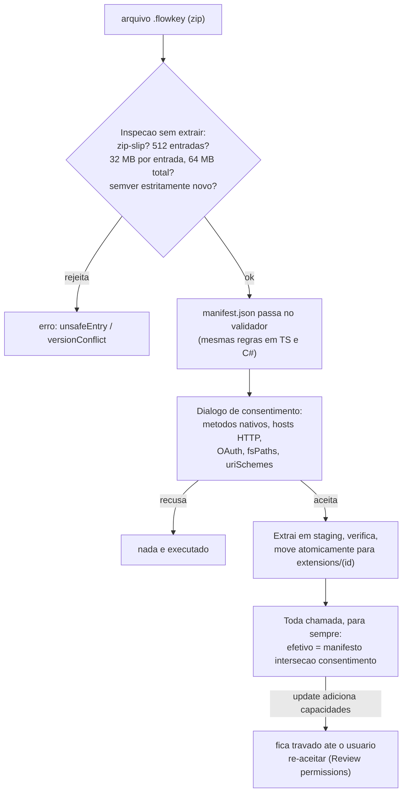

As camadas, em ordem:

1. **Instalação (`ExtensionPackageInstaller`)** — inspeção do zip sem extrair: máx. 512 entradas, 32
   MB por entrada, 64 MB total, rejeição de caminhos absolutos e de qualquer segmento `..`
   (zip-slip). Instalação exige **semver estritamente novo**. Extração em diretório de staging com
   checagem de prefixo, depois `Directory.Move` atômico.
2. **Validação dupla** — o manifesto é validado pelo TypeScript (no CLI e no carregamento) e por um
   validador C# espelho no shell, ambos presos às mesmas fixtures.
3. **Consentimento granular** — o diálogo lista **todo** conjunto declarado: métodos nativos, hosts
   de rede, providers OAuth, globs de filesystem, schemes de URI. Nada roda antes do aceite. O
   conjunto aceito é persistido.
4. **Interseção permanente** — a cada chamada, `ExtensionPolicy.DeclarationsFor` computa
   **manifesto ∩ consentimento armazenado**. Lista de consentimento ausente = nada concedido. Uma
   atualização que adiciona capacidades **as perde silenciosamente** até o usuário re-aceitar.
5. **Gate por chamada** — `OnNativeCallRequested` revalida tudo na hora: método não declarado →
   `methodNotDeclared`; host fora da allowlist → `hostNotAllowed` (com os antifraudes SSRF da seção
   5.5); provider OAuth não declarado → `providerNotDeclared`.
6. **Segredos fora do alcance** — tokens OAuth e preferências `password` vivem cifrados com DPAPI no
   shell e **nunca transitam para o sidecar**.
7. **Desinstalação completa** — remover uma extensão apaga diretório, storage, cache, segredos,
   tokens e cache de imagens.

E as ausências deliberadas completam o modelo (documentadas como "deliberately not implemented"):
**sem telemetria**, **sem IA/LLM**, extensões **não executam processos**, não há deep links
`flowkey://` nem comunicação entre extensões.

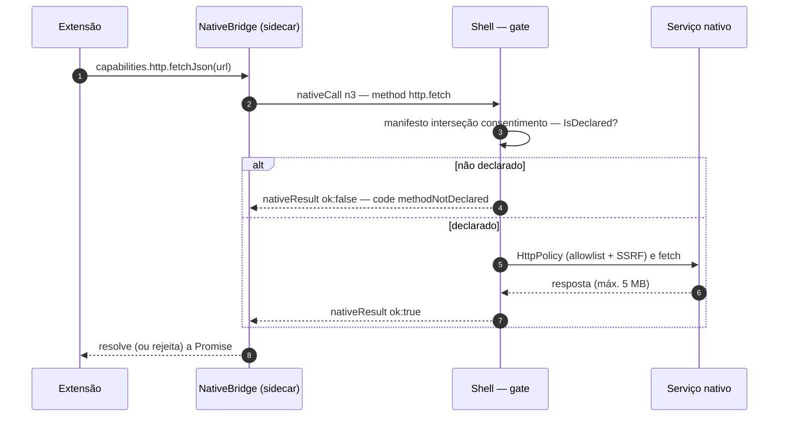

---

## 12. A interface web: WebView2 onde faz sentido

O slogan "sem web view" descreve a **superfície principal** — mas o projeto reconhece que algumas
UIs pedem riqueza que uma árvore de 24 tags não dá. Para isso existe o modo `ui: "web"`, além de
duas superfícies de chrome do próprio shell. São **três superfícies WebView2** compartilhando **um
único processo de browser** (uma pasta de user-data comum):

| Superfície            | Virtual host                                    | Conteúdo                                                                                                                          |
| --------------------- | ----------------------------------------------- | --------------------------------------------------------------------------------------------------------------------------------- |
| Comandos `ui: web`    | `https://extensions.flowkey.local`              | O bundle da extensão (`app.web.js`), servido num host page comum                                                                  |
| Host pages + Settings | `https://app.flowkey.local`                     | `webhost.html`, `footerhost.html`, `settingshost.html`, assets do settings                                                        |
| Arte/preview          | `art.flowkey.local` / `clipboard.flowkey.local` | Cache de imagens e previews de clipboard (URIs `file:` são reescritas para cá, porque o Chromium recusa `file:` em páginas https) |

As garantias:

- **CSP estrita** (`default-src 'none'`, script-src apenas nos hosts `.flowkey.local`), navegação
  para fora dos hosts mapeados é cancelada no `NavigationStarting`.
- **Chamadas de capacidade relayadas**: a página posta `{bridgeId, method, params}` → o shell envia
  `webCall` ao sidecar → a chamada passa pelo **mesmo** `NativeBridge` gateado → volta como
  `webResult`. A identidade da extensão é **carimbada pelo shell** — a página não pode fingir ser
  outra extensão.
- **Higiene de memória**: teardown completo dos WebViews após tempo oculto (com `GC.Collect`
  dobrado para liberar de verdade a árvore do Chromium), descarte após 30 s ocioso, nível de memória
  `Low` quando escondido.

### 12.1 O app de configurações (settings-ui)

As configurações inteiras são uma SPA **React 19 + Tailwind CSS 4 + Radix UI** (padrão shadcn),
empacotada com esbuild para dentro dos assets do shell. A página nunca toca em store ou SO: ela
recebe **pushes de estado** (`SettingsState` completo, camelCase, espelhando os records C#) e cada
operação é um _invoke op_ executado por `SettingsOperations.cs` no lado nativo — instalar extensão,
revisar permissões, gravar preferência, capturar hotkey, checar update.

<!-- 📷 ESPAÇO PARA IMAGEM: janela de configurações — página de uma extensão com o diálogo de
     consentimento aberto, mostrando a lista de capacidades.
     Sugestão: docs/images/flowkey-settings-consent.png -->

O rodapé do launcher também é WebView2 (`footerhost.html`) com fallback XAML nativo enquanto a
página não sinaliza `ready` — um padrão elegante de _progressive enhancement_ em app de desktop.

---

## 13. Qualidade: testes, fixtures e CI

A matriz de verificação local é um único comando que encadeia tudo:

```bash
pnpm --dir flowkey-native test
```

| Camada     | Ferramenta     | O que roda                                                                                       |
| ---------- | -------------- | ------------------------------------------------------------------------------------------------ |
| TypeScript | `tsc --noEmit` | typechecks de sdk, react-ui, cli, sidecar, settings-ui e extensões                               |
| TypeScript | `bun test`     | sdk (71 casos), react-ui (34), cli (6), sidecar (4 suítes) e suítes por extensão (~2.700 linhas) |
| C#         | `dotnet test`  | xUnit: **52 arquivos de teste, 417 `[Fact]` + 27 `[Theory]`** (~444+ casos)                      |

Destaques da suíte C#: políticas de segurança (`HttpPolicyTests`, `OAuthServiceTests`,
`ExtensionManifestPolicyTests`, `FsPolicyTests`, `ConsentResilienceTests`), fixtures do contrato
(`UiTreeFixtureTests`), e classes puras extraídas justamente para serem testáveis
(`GridMathTests`, `FuzzyMatcherTests`, `RootRankerTests`, `MarkdownLiteTests`).

**CI e releases** (GitHub Actions) seguem duas linhas independentes:

- **`shell-v*`** → roda os testes do shell, publica o bundle do settings-ui, `dotnet publish`
  self-contained, compila o sidecar com `bun build --compile`, builda todas as extensões via CLI,
  empacota com `vpk pack` (Velopack) e publica no GitHub Releases (instalador + zip portátil).
- **`flowkey-sdk-v*`** → typechecks + testes dos pacotes TS e publica no npm **em ordem de
  dependência**: `native-sdk` → `react-ui` → `cli`.
- **CodeQL** roda em push/PR + semanalmente.

---

## 14. Números do projeto

| Métrica               | Valor                                                                                                                                        |
| --------------------- | -------------------------------------------------------------------------------------------------------------------------------------------- |
| Shell C#              | 148 arquivos `.cs`, ~29.000 linhas + 1.367 de XAML                                                                                           |
| Maior arquivo         | `MainWindow.xaml.cs` — 4.802 linhas                                                                                                          |
| Sidecar TypeScript    | 5 arquivos, 1.403 linhas                                                                                                                     |
| SDK                   | ~2.260 linhas, ~90 exportações, 17 grupos de capacidades (~57 métodos)                                                                       |
| react-ui              | ~2.120 linhas; serializador com 978 linhas                                                                                                   |
| Settings-ui           | 28 arquivos, ~2.500 linhas de TS/TSX                                                                                                         |
| Extensões first-party | 12 extensões, 57 comandos, ~14.800 linhas                                                                                                    |
| Protocolo             | versão 1, 18 tipos de mensagem                                                                                                               |
| Vocabulário de UI     | 4 tipos de raiz, 24 tags, 10 tipos de campo de form, 4 codificações de ícone                                                                 |
| Contrato              | 3 fixtures (~1.330 linhas de JSON), 26 casos de manifesto                                                                                    |
| Testes                | ~444+ casos xUnit + 111 casos Bun nos pacotes + suítes por extensão e sidecar                                                                |
| Knobs de runtime      | debounce de busca 120 ms · throttle de uiPush 100 ms · timeout de nativeCall 5 s · máx. 4 raízes React · intervalo mínimo de background 60 s |

Distribuição aproximada de linhas de código por camada (excluindo testes de extensões e CLI):

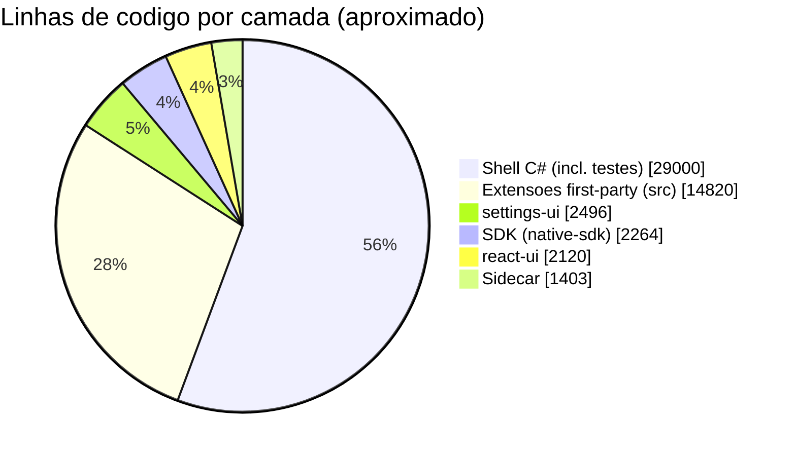

---

## 15. Criando sua própria extensão

Do zero até instalada, sem clonar o repositório:

```bash
npx @flowkey-cli/cli init "My Extension"
cd my-extension && pnpm install
pnpm dev        # build + instala no FlowKey + watch
pnpm package    # gera my-extension-0.1.0.flowkey
```

E o código de uma view é React de carteirinha:

```tsx
import {
  List,
  Action,
  ActionPanel,
  defineReactExtension,
  type CommandProps,
} from '@flowkey-cli/react-ui';
import manifest from '../manifest.json';

function MyView(props: CommandProps) {
  return (
    <List>
      <List.Item
        id="example"
        title={props.query || 'Type something'}
        actions={
          <ActionPanel>
            <Action
              title="Save"
              onAction={async () => {
                await props.capabilities.storage.set('last', props.query);
                await props.capabilities.hud.show({ title: 'Saved!' });
              }}
            />
          </ActionPanel>
        }
      />
    </List>
  );
}

export default defineReactExtension({ manifest, component: MyView });
```

Repare no que **não** existe nesse código: fetch de token, chamadas ao SO, gerenciamento de
janela. As capacidades chegam por props, tipadas, já gateadas — e o que a extensão pode pedir é
exatamente o que o manifesto declara e o usuário aceitou.

---

## 16. Conclusão

O FlowKey é um estudo de caso raro de **híbrido nativo/web bem dosado**. Em vez de escolher entre
"app nativo fechado" e "plataforma Electron extensível", ele pega o melhor dos dois mundos:

1. **UX nativa de verdade** — a UI que o usuário vê é WPF: sem DOM, sem Chromium na superfície
   principal, com toda a economia de memória que isso traz (os WebViews existem apenas onde valem a
   pena e são descartados agressivamente).
2. **DX de web de verdade** — extensões em TypeScript + React, com hooks, cache e tipagem completa,
   scaffold e watch mode em uma linha.
3. **Um contrato executável** — fixtures JSON testadas simultaneamente em Bun e xUnit transformam a
   fronteira entre duas linguagens em algo que não apodrece.
4. **Segurança como produto** — consentimento granular que não apodrece com updates (a interseção
   manifesto ∩ consentimento), antifraude SSRF de séria no `http.fetch`, tokens que nunca chegam ao
   código de terceiros e um modelo fail-closed consistente do instalador ao runtime.

As lições que ficam para qualquer projeto com processo hospedeiro + plugins:

- **Fixtures compartilhadas entre linguagens** batam qualquer schema de documentação.
- **"Árvore serializada + registry de callbacks"** é um padrão excelente para deixar UI declarativa
  segura: funções nunca cruzam o fio, e o host só pode disparar o que foi renderizado.
- **Uma única instância de runtime compartilhada via globals** resolve elegantemente o problema de
  duplicação de React em arquiteturas de plugin.
- **Whitelist como API**: no `system.control` e nos `httpHosts`, a lista do que é permitido é a
  própria interface de consentimento — não há como pedir "permissão total".

Se você quiser estudar o código, a ordem que eu recomendo é: `contract/` (a lei) →
`sdk/src/types.ts` (o vocabulário) → `react-ui/src/serialize.ts` (a mágica) → `sidecar/src/` (o
cérebro em 1.400 linhas) → e só então os 4.802 linhas do `MainWindow.xaml.cs` (o portão).

---

_Post gerado a partir de análise do código-fonte do repositório (outubro de 2026). Screenshots
referenciados vivem em `docs/images/`; os placeholders marcados com 📷 indicam capturas a produzir._
